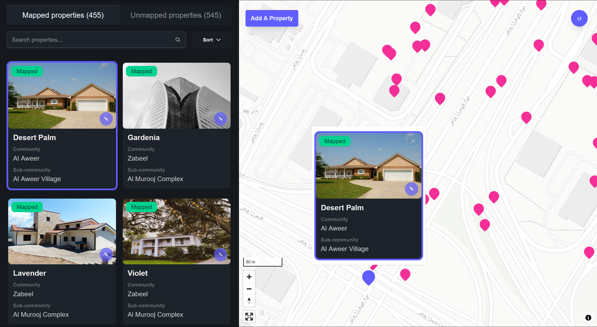
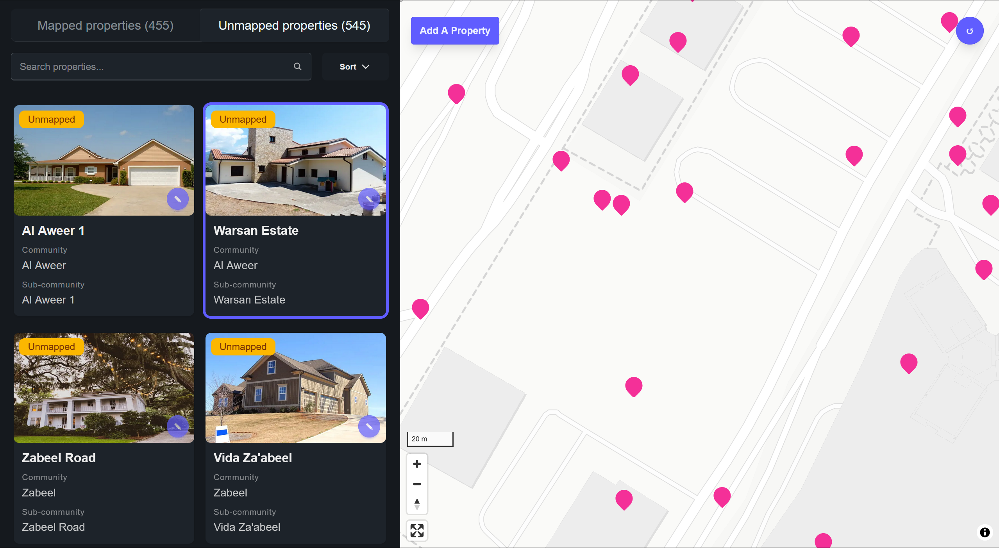
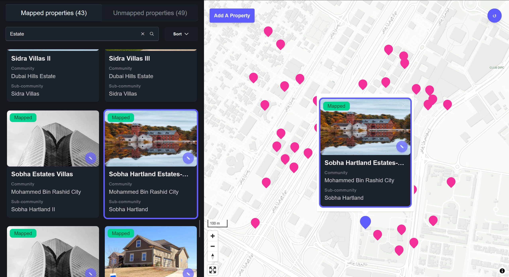

# Places

Places is a web application for browsing large lists of property listings on a map, showcasing modern web technologies and best practices for data fetching, state management, and UI design. This project leverages Next.js 15, nuqs, Supabase, and other cutting-edge tools to provide a seamless and efficient user experience.

## Project Overview

Places provides a map view of property listings, allowing users to explore properties based on their location. Unmapped properties are displayed in a dedicated sidebar tab.



### Frontend

- **Next.js 15**: Used for server-side data fetching of Properties from Supabase and passing data to client components like PropertyCard and PropertyModal. Leverages React Server Components (RSC) for optimal performance.
- **nuqs**: Primary state management using URL query parameters, enabling shareable links and bookmarkable states.
- **React Hook Form & Zod**: Employed for form handling and schema validation, ensuring type safety and robust validation.
- **Tailwind CSS v4**: Applied for styling, providing a utility-first approach to design.
- **DaisyUI v5 (Beta)**: Used for UI components, built on top of Tailwind CSS.
- **Vis.gl React Maplibre**: For interactive map rendering.
- **Tanstack Virtual**: For efficiently rendering large lists of properties in the sidebar.

### Backend

- **Supabase**: Used as the primary database for storing property data.
- **Next.js Server Actions**: Used for performing database mutations.

### Additional Packages

- **@turf/turf**: Geospatial analysis library for performing calculations on map data.
- **@vis.gl/react-maplibre**: React bindings for Maplibre GL JS, an open-source library for rendering interactive maps.

### Key Features

- **Interactive Map**: Displays property listings on a map with custom markers and popups.
  - **Marker Highlighting**: Clicking a marker on the map highlights it, displays a popup with property information, and smoothly scrolls the corresponding property card into view in the sidebar. This provides immediate visual feedback and context.
- **Sidebar with Property Listings**: Shows a list of properties with mapped and unmapped properties in separate tabs.
  - **Smooth Scrolling**: The sidebar utilizes `Tanstack Virtual` to efficiently render large lists of properties, ensuring smooth scrolling even with numerous listings.
  - **Mapped/Unmapped Separation**: Properties are clearly categorized as either mapped (with location data) or unmapped (e.g., off-plan properties), improving organization and user understanding.
- **Dynamic Filtering**: Allows users to filter properties based on search queries.
  - **URL-Driven Search**: The search query is managed via `nuqs`, making search results shareable and bookmarkable.
- **Sorting**: Allows users to sort properties by property name, community, or subcommunity.
  - **URL-Driven Sorting**: Sort parameters are also managed through `nuqs`, maintaining consistency and shareability. The available sort options are: property name, community, and subcommunity.
- **Property Details**: Displays detailed information about each property in a popup.
- **Add/Edit Property**: Allows users to add new properties or edit existing ones. (mutations need improvement).
- **State Management**: Utilizes URL query parameters for state management, enabling shareable links and bookmarkable states.
- **Responsive Design**: Provides a responsive user interface that adapts to different screen sizes.

## Architectural Decisions

### URL as State Store with `nuqs`

The project leverages `nuqs` for managing application state using URL query parameters. This approach offers several advantages:

1. **Shareable Links**: Users can share URLs to preserve the current state of the application (e.g., a specific property selected, search terms, sort order).
2. **Bookmarkable**: Users can bookmark specific states, such as a filtered list of properties or a particular property's view.
3. **Consistent State Management**: URL state management works seamlessly with server components in Next.js 15, ensuring consistency between server-rendered and client-rendered content.
4. **SEO Benefits**: URLs with meaningful query parameters improve search engine indexing.

We leverage `nuqs` for state management across both server and client components, maintaining synchronization between server-rendered and client-rendered states. URL parameters are validated using Zod schemas to ensure data integrity. A custom hook (`useMapParams`) provides components with a clean interface for reading and updating URL-based state.

### Open Source Mapping with Maplibre GL JS

The project uses Maplibre GL JS, an open-source library for rendering interactive maps. This choice aligns with the project's commitment to open-source technologies and provides a flexible and customizable mapping solution. The `react-map-gl` and `react-maplibre` packages provide React bindings for Maplibre.

### Geospatial Analysis with Turf.js

Turf.js is used for performing geospatial calculations, such as determining if a coordinate is within a specific geofence (though this specific geofencing functionality is not fully implemented in the current code). This library provides a comprehensive set of tools for working with geospatial data.

### Tanstack Virtual for Efficient List Rendering

To handle large datasets of properties, the project utilizes Tanstack Virtual (`@tanstack/react-virtual`) for efficiently rendering the property list in the sidebar (`PropertyList.tsx`). This library virtualizes the list, rendering only the visible items and improving performance significantly. The `useVirtualizer` hook is used to manage the virtualization.

### Data Fetching with Custom Hooks

Property data is fetched from Supabase using custom hooks (`useProperties` hook and the query in `property-queries.ts`). This approach abstracts the data fetching logic from the components, making them more reusable and testable. It also allows for easy switching to a different data source in the future. The `getAllProperties` function uses the Supabase client to fetch data and then maps the DTO to the RTO using `mapPropertyDtoToRto`.

### Schema -> DTO -> RTO -> Mapper Function Flow

The project implements a Schema -> DTO -> RTO -> Mapper Function flow for managing data. This approach provides several benefits:

1. **Data Validation**: Zod schemas (`schema.ts`) are used to validate data at the boundaries of the application (both for database interactions and URL parameters).
2. **Data Transformation**: DTOs (Data Transfer Objects) are used to represent data in a format that is suitable for the backend (Supabase).
3. **Data Presentation**: RTOs (Render Transfer Objects) are used to represent data in a format that is suitable for the frontend (React components).
4. **Loose Coupling**: Mapper functions (e.g., `mapPropertyDtoToRto`) are used to transform data between the different layers, reducing coupling between the components and the data source.

While this approach requires more initial setup, it provides a more robust and maintainable codebase, making it easier to adapt to changes in the data structure or the UI.

### Separation of Concerns

The project is structured to separate concerns as much as possible. Components are designed to be "dumb" and focus on rendering data, while the logic is moved to custom hooks (e.g., `useProperties`, `useMapNavigation`) and utility functions. This approach makes the codebase more testable, maintainable, and easier to understand. The `page.tsx` file demonstrates this by fetching data using `getAllProperties` and passing it to the `PropertyList` and `MapWrapper` components.

## Areas of Improvement

- **UI Styling**: The current DaisyUI version is a beta version running on Tailwind CSS v4, which results in styling issues (particularly with padding -- manual fix applied).
- **Geocoding**: Implement geocoding to automatically determine the location coordinates based on the property address. This would improve data accuracy and user experience.
- **Enhanced Search Functionality**: Improve search to include more product attributes (e.g., price, number of bedrooms).
- **Complete Add/Edit Functionality**: Fully implement the UI and logic for adding and editing properties.

## Getting Started

1. **Install dependencies**:

   ```bash
   npm install
   ```

2. **Start the development server**:

   ```bash
   npm run dev
   ```

3. **Build for production**:

   ```bash
   npm run build
   ```

4. **Start the production server**:

   ```bash
   npm start
   ```

## Screenshots






## Conclusion

Places exemplifies modern web applications by leveraging URL state management, open-source mapping libraries, and a robust data flow architecture. This approach ensures that the application is highly performant, easy to maintain, and adaptable to future web technologies, making it a robust solution for property browsing.
